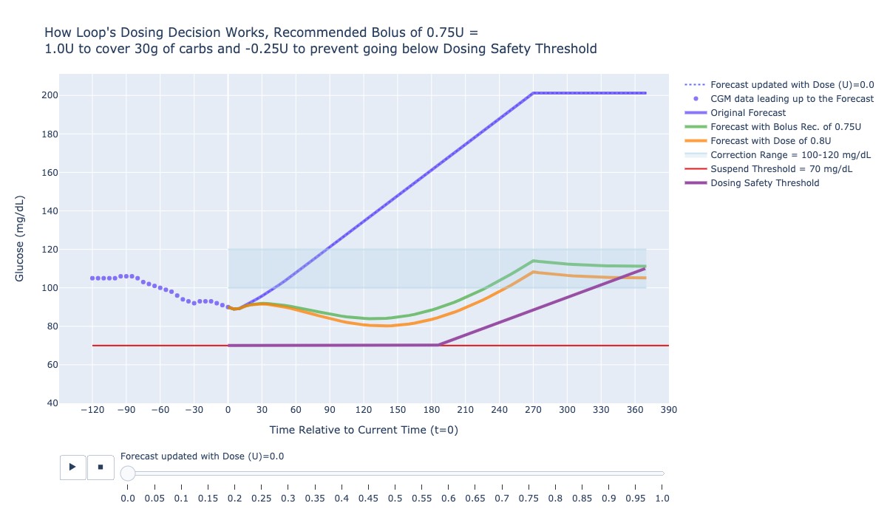

# How Loop Dosing Decisions Work

    
## Project Objective
The purpose of this project is to demonstrate how loop dosing decisions work using a simple animation (slider).

## Run in Browser

## Run Locally
### Getting Started with the Conda Virtual Environment
1. Install [Miniconda](https://conda.io/miniconda.html). CAUTION for python virtual env users: Anaconda will automatically update your .bash_profile
so that conda is launched automatically when you open a terminal. You can deactivate with the command `conda deactivate`
or you can edit your bash_profile.
2. If you are new to [Anaconda](https://docs.anaconda.com/anaconda/user-guide/getting-started/)
check out their getting started docs.
3. If you want the pre-commit githooks to install automatically, then following these
[directions](https://pre-commit.com/#automatically-enabling-pre-commit-on-repositories).
4. Clone this repo (for help see this [tutorial](https://help.github.com/articles/cloning-a-repository/)).
5. In a terminal, navigate to the directory where you cloned this repo.
6. Run `conda update -n base -c defaults conda` to update to the latest version of conda
7. Run `conda env create -f conda-environment.yml --name [input-your-env-name-here]`. This will download all of the package dependencies
and install them in a conda (python) virtual environment. (Insert your conda env name in the brackets. Do not include the brackets)
8. Run `conda env list` to get a list of conda environments and select the environment
that was created from the environmental.yml file (hint: environment name is at the top of the file)
9. Run `conda activate <conda-env-name>` or `source activate <conda-env-name>` to start the environment.
10. If you did not setup your global git-template to automatically install the pre-commit githooks, then
run `pre-commit install` to enable the githooks.
11. Run `deactivate` to stop the environment.

### Maintaining Compatability with venv and virtualenv
This may seem counterintuitive, but when you are loading new packages into your conda virtual environment,
load them in using `pip`, and export your environment using `pip-chill > requirements.txt`.
We take this approach to make our code compatible with people that prefer to use venv or virtualenv.
This may also make it easier to convert existing packages into pypi packages. We only install packages directly
in conda using the conda-environment.yml file when packages are not available via pip (e.g., R and plotly-orca).

## Tidepool Data Science Team
|Name (with github link)    |  [Tidepool Slack](https://tidepoolorg.slack.com/)   |
|---------|-----------------|
|[Ed Nykaza](https://github.com/[ed-nykaza])| @ed        |
|[Jason Meno](https://github.com/[jameno]) |  @jason    |
|[Cameron Summers](https://github.com/[scaubrey]) |  @Cameron Summers    |
